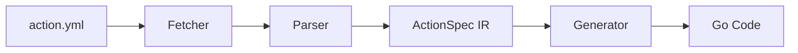

<picture>
  <source media="(prefers-color-scheme: dark)" srcset="./wetwire-dark.svg">
  
</picture>

This document covers the action wrapper code generation system in wetwire-github-go.

**Contents:**
- [Overview](#overview)
- [The StepAction Interface](#the-stepaction-interface)
- [Schema Fetching](#schema-fetching)
- [Parsing action.yml Files](#parsing-actionyml-files)
- [Type Generation](#type-generation)
- [Adding a New Action Wrapper](#adding-a-new-action-wrapper)
- [Generated Code Structure](#generated-code-structure)
- [Type Inference](#type-inference)

---

## Overview

The `codegen` package provides tools to automatically generate type-safe Go wrappers for GitHub Actions. Instead of manually maintaining action wrappers, you can:

1. Fetch `action.yml` files directly from GitHub repositories
2. Parse the action inputs and outputs
3. Generate idiomatic Go structs with proper types and YAML tags

This ensures action wrappers stay in sync with upstream action definitions and reduces manual maintenance burden.



---

## The StepAction Interface

All action wrappers implement the `StepAction` interface defined in `workflow/step.go`:

```go
// StepAction is implemented by action wrappers for serialization.
// Action wrappers implement this interface to be used directly in Steps.
type StepAction interface {
    // Action returns the action reference (e.g., "actions/checkout@v4").
    Action() string
    // Inputs returns the action inputs as a map.
    Inputs() map[string]any
}
```

This interface enables:

1. **Direct usage in Steps**: Action wrappers can be used directly in job step slices without conversion
2. **Automatic serialization**: The serializer detects `StepAction` types and converts them to proper YAML
3. **Type-safe inputs**: Compile-time validation of action parameters

### Usage Example

```go
var BuildSteps = []any{
    checkout.Checkout{FetchDepth: 0},           // StepAction
    setup_go.SetupGo{GoVersion: "1.23"},        // StepAction
    workflow.Step{Run: "go build ./..."},       // Regular Step
}
```

The serializer in `internal/serialize/serialize.go` handles both types:

```go
func anyStepToMap(s any) (map[string]any, error) {
    switch v := s.(type) {
    case workflow.Step:
        return stepToMap(&v)
    case workflow.StepAction:
        // Convert action wrapper to Step and serialize
        step := workflow.ToStep(v)
        return stepToMap(&step)
    default:
        return nil, fmt.Errorf("unsupported step type: %T", s)
    }
}
```

---

## Schema Fetching

The `Fetcher` type in `codegen/fetch.go` retrieves action schemas from GitHub.

### Fetcher API

```go
// Create a fetcher with default settings
fetcher := codegen.NewFetcher()

// Fetch by known action name
yaml, err := fetcher.FetchAction("checkout")

// Fetch by owner/repo directly
yaml, err := fetcher.FetchActionByOwnerRepo("actions", "setup-go")
```

### URL Pattern

Action schemas are fetched from:

```
https://raw.githubusercontent.com/{owner}/{repo}/main/action.yml
```

### Popular Actions Registry

The package includes a registry of popular actions:

```go
var PopularActions = map[string]struct{ Owner, Repo string }{
    "checkout":          {"actions", "checkout"},
    "setup-go":          {"actions", "setup-go"},
    "setup-node":        {"actions", "setup-node"},
    "setup-python":      {"actions", "setup-python"},
    "cache":             {"actions", "cache"},
    "upload-artifact":   {"actions", "upload-artifact"},
    "download-artifact": {"actions", "download-artifact"},
}
```

### Retry Logic

The fetcher includes built-in retry logic:

```go
type Fetcher struct {
    Client     *http.Client
    MaxRetries int           // Default: 3
    RetryDelay time.Duration // Default: 1 second
}
```

### Bulk Fetching

Fetch all registered schemas and actions:

```go
manifest, err := fetcher.FetchAll("./specs")
// Creates:
// - specs/manifest.json
// - specs/checkout.yml
// - specs/setup-go.yml
// - ...
```

---

## Parsing action.yml Files

The `ParseActionYAML` function parses action.yml content into an intermediate representation.

### ActionSpec Structure

```go
type ActionSpec struct {
    Name        string                  // Action name
    Description string                  // Action description
    Author      string                  // Action author
    Inputs      map[string]ActionInput  // Input parameters
    Outputs     map[string]ActionOutput // Output values
    Runs        ActionRuns              // Execution config
    Branding    *ActionBranding         // Marketplace branding
}

type ActionInput struct {
    Description        string // Input description
    Required           bool   // Whether input is required
    Default            string // Default value
    DeprecationMessage string // Deprecation notice
}

type ActionOutput struct {
    Description string // Output description
    Value       string // Output value expression
}
```

### Usage

```go
spec, err := codegen.ParseActionYAML(yamlBytes)

// Access input names
inputs := spec.GetInputNames()

// Get required inputs only
required := spec.GetRequiredInputs()

// Check action type
if spec.IsJavaScriptAction() {
    // Node.js action
}
if spec.IsCompositeAction() {
    // Composite action with steps
}
if spec.IsDockerAction() {
    // Docker container action
}
```

### Example action.yml

```yaml
name: 'Setup Go environment'
description: 'Setup a Go environment and add it to PATH'
inputs:
  go-version:
    description: 'The Go version to download (if necessary) and use'
    required: false
  go-version-file:
    description: 'Path to the go.mod file'
    required: false
  cache:
    description: 'Used to specify whether caching is needed'
    default: true
runs:
  using: 'node20'
  main: 'dist/setup/index.js'
```

---

## Type Generation

The `Generator` type converts `ActionSpec` to Go code.

### Generator API

```go
gen := codegen.NewGenerator()

// Generate from parsed spec
code, err := gen.GenerateActionWrapper(codegen.ActionWrapperConfig{
    ActionRef:   "actions/checkout@v4",
    PackageName: "checkout",
    TypeName:    "Checkout",
    Spec:        spec,
})

// Or generate directly from YAML
code, err := gen.GenerateActionWrapperFromYAML(yamlBytes, "actions/setup-go@v5")
```

### GeneratedCode Result

```go
type GeneratedCode struct {
    PackageName string // Go package name (e.g., "checkout")
    FileName    string // Output file name (e.g., "checkout.go")
    Code        []byte // Formatted Go source code
}
```

### Name Conversion

The generator converts action names to Go conventions:

| Original | Go Field Name | Go Type Name |
|----------|---------------|--------------|
| `go-version` | `GoVersion` | - |
| `fetch-depth` | `FetchDepth` | - |
| `setup-go` | - | `SetupGo` |
| `docker-build-push` | - | `DockerBuildPush` |

Helper functions:

```go
// Convert input name to Go field name
name := codegen.GetGoFieldName("fetch-depth") // "FetchDepth"

// Convert action name to Go type name
typeName := codegen.GetGoTypeName("setup-go") // "SetupGo"
```

---

## Adding a New Action Wrapper

### Step 1: Create the Package Directory

```bash
mkdir -p actions/my_action
```

### Step 2: Generate the Wrapper

Option A - Using the codegen package programmatically:

```go
package main

import (
    "os"
    "github.com/lex00/wetwire-github-go/codegen"
)

func main() {
    fetcher := codegen.NewFetcher()
    gen := codegen.NewGenerator()

    // Fetch action.yml
    yaml, err := fetcher.FetchActionByOwnerRepo("owner", "repo")
    if err != nil {
        panic(err)
    }

    // Generate wrapper
    code, err := gen.GenerateActionWrapperFromYAML(yaml, "owner/repo@v1")
    if err != nil {
        panic(err)
    }

    // Write to file
    os.WriteFile("actions/my_action/my_action.go", code.Code, 0644)
}
```

Option B - Manual creation following the pattern:

```go
// Package my_action provides a typed wrapper for owner/repo.
package my_action

// MyAction wraps the owner/repo@v1 action.
// Description of the action.
type MyAction struct {
    // Description of input
    InputName string `yaml:"input-name,omitempty"`

    // Whether to enable feature
    Enabled bool `yaml:"enabled,omitempty"`

    // Number of retries
    RetryCount int `yaml:"retry-count,omitempty"`
}

// Action returns the action reference.
func (a MyAction) Action() string {
    return "owner/repo@v1"
}

// Inputs returns the action inputs as a map.
func (a MyAction) Inputs() map[string]any {
    with := make(map[string]any)

    if a.InputName != "" {
        with["input-name"] = a.InputName
    }
    if a.Enabled {
        with["enabled"] = a.Enabled
    }
    if a.RetryCount != 0 {
        with["retry-count"] = a.RetryCount
    }

    return with
}
```

### Step 3: Add Tests

```go
package my_action_test

import (
    "testing"
    "github.com/lex00/wetwire-github-go/actions/my_action"
    "github.com/lex00/wetwire-github-go/workflow"
)

func TestMyAction_ImplementsStepAction(t *testing.T) {
    var _ workflow.StepAction = my_action.MyAction{}
}

func TestMyAction_Action(t *testing.T) {
    a := my_action.MyAction{}
    if got := a.Action(); got != "owner/repo@v1" {
        t.Errorf("Action() = %q, want %q", got, "owner/repo@v1")
    }
}

func TestMyAction_Inputs(t *testing.T) {
    a := my_action.MyAction{
        InputName: "test",
        Enabled:   true,
    }

    inputs := a.Inputs()

    if inputs["input-name"] != "test" {
        t.Errorf("missing input-name")
    }
    if inputs["enabled"] != true {
        t.Errorf("missing enabled")
    }
}
```

---

## Generated Code Structure

### Template

The generator uses this template for action wrappers:

```go
// Code generated by wetwire-github codegen. DO NOT EDIT.

package {{.PackageName}}

// {{.TypeName}} wraps the {{.ActionRef}} action.
// {{.Spec.Description}}
type {{.TypeName}} struct {
{{- range .Fields}}
    // {{.Description}}
    {{.Name}} {{.Type}} `yaml:"{{.YAMLName}},omitempty"`
{{- end}}
}

// Action returns the action reference.
func (a {{.TypeName}}) Action() string {
    return "{{.ActionRef}}"
}

// Inputs returns the action inputs as a map.
func (a {{.TypeName}}) Inputs() map[string]any {
    with := make(map[string]any)
{{- range .Fields}}
{{- if eq .Type "string"}}
    if a.{{.Name}} != "" {
        with["{{.YAMLName}}"] = a.{{.Name}}
    }
{{- else if eq .Type "int"}}
    if a.{{.Name}} != 0 {
        with["{{.YAMLName}}"] = a.{{.Name}}
    }
{{- else if eq .Type "bool"}}
    if a.{{.Name}} {
        with["{{.YAMLName}}"] = a.{{.Name}}
    }
{{- end}}
{{- end}}
    return with
}
```

### Field Ordering

Fields are sorted with:
1. Required fields first
2. Then alphabetically by name

---

## Type Inference

The generator infers Go types from action input definitions.

### Boolean Detection

Inputs are typed as `bool` when:

```go
// Default value is "true" or "false"
input.Default == "true" || input.Default == "false"

// Description contains these keywords
strings.Contains(desc, "whether")
strings.Contains(desc, "enable")
strings.Contains(desc, "disable")
```

### Integer Detection

Inputs are typed as `int` when:

```go
// Default value is numeric
isNumericDefault(input.Default) // only digits 0-9

// Description contains these keywords
strings.Contains(desc, "number")
strings.Contains(desc, "count")
strings.Contains(desc, "depth")
strings.Contains(desc, "timeout")
```

### Default to String

All other inputs default to `string` type.

### Examples

| Input | Inferred Type | Reason |
|-------|---------------|--------|
| `default: true` | `bool` | Boolean default |
| `default: false` | `bool` | Boolean default |
| `default: 1` | `int` | Numeric default |
| `default: 0` | `int` | Numeric default |
| `description: "Number of retries"` | `int` | "number" in description |
| `description: "Fetch depth"` | `int` | "depth" in description |
| `description: "Whether to cache"` | `bool` | "whether" in description |
| `description: "Enable caching"` | `bool` | "enable" in description |
| `description: "The version"` | `string` | No type hints |

---

## Existing Action Wrappers

The `actions/` directory contains wrappers for popular GitHub Actions:

| Package | Action | Description |
|---------|--------|-------------|
| `checkout` | `actions/checkout@v4` | Git repository checkout |
| `setup_go` | `actions/setup-go@v5` | Go environment setup |
| `setup_node` | `actions/setup-node@v4` | Node.js environment setup |
| `setup_python` | `actions/setup-python@v5` | Python environment setup |
| `setup_java` | `actions/setup-java@v4` | Java environment setup |
| `setup_ruby` | `actions/setup-ruby@v1` | Ruby environment setup |
| `setup_rust` | `dtolnay/rust-toolchain@stable` | Rust toolchain setup |
| `setup_dotnet` | `actions/setup-dotnet@v4` | .NET environment setup |
| `cache` | `actions/cache@v4` | Dependency caching |
| `upload_artifact` | `actions/upload-artifact@v4` | Artifact upload |
| `download_artifact` | `actions/download-artifact@v4` | Artifact download |
| `docker_login` | `docker/login-action@v3` | Docker registry login |
| `docker_build_push` | `docker/build-push-action@v6` | Docker build and push |
| `docker_setup_buildx` | `docker/setup-buildx-action@v3` | Docker Buildx setup |
| `gh_release` | `softprops/action-gh-release@v2` | GitHub release creation |
| `github_script` | `actions/github-script@v7` | Custom JavaScript in workflows |
| `codecov` | `codecov/codecov-action@v4` | Code coverage upload |
| `golangci_lint` | `golangci/golangci-lint-action@v6` | Go linting |
| `aws_configure_credentials` | `aws-actions/configure-aws-credentials@v4` | AWS credential configuration |
| `aws_ecr_login` | `aws-actions/amazon-ecr-login@v2` | AWS ECR login |
| `azure_login` | `azure/login@v2` | Azure authentication |
| `azure_docker_login` | `azure/docker-login@v2` | Azure container registry login |
| `azure_webapps_deploy` | `azure/webapps-deploy@v3` | Azure Web App deployment |
| `gcp_auth` | `google-github-actions/auth@v2` | GCP authentication |
| `gcp_setup_gcloud` | `google-github-actions/setup-gcloud@v2` | gcloud CLI setup |
| `gcp_deploy_cloudrun` | `google-github-actions/deploy-cloudrun@v2` | Cloud Run deployment |
| `codeql_init` | `github/codeql-action/init@v3` | CodeQL initialization |
| `codeql_analyze` | `github/codeql-action/analyze@v3` | CodeQL analysis |
| `trivy` | `aquasecurity/trivy-action@0.28.0` | Container security scanning |
| `scorecard` | `ossf/scorecard-action@v2` | OpenSSF Scorecard |
| `dependency_review` | `actions/dependency-review-action@v4` | Dependency review |
| `create_pull_request` | `peter-evans/create-pull-request@v6` | Automated PR creation |
| `labeler` | `actions/labeler@v5` | Automatic PR labeling |
| `stale` | `actions/stale@v9` | Stale issue management |

---

## See Also

- [Internals](INTERNALS.md) - Overall architecture
- [Developer Guide](DEVELOPERS.md) - Development workflow
- [Quick Start](QUICK_START.md) - Getting started
