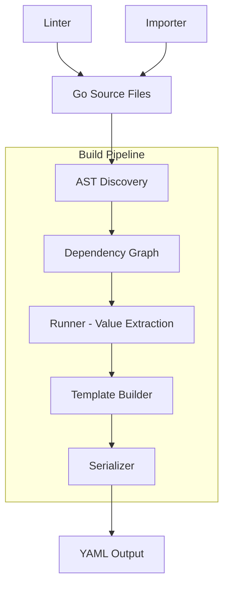

<picture>
  <source media="(prefers-color-scheme: dark)" srcset="./wetwire-dark.svg">
  
</picture>

This document covers the internal architecture of wetwire-github-go for contributors and maintainers.

**Contents:**
- [Architecture Overview](#architecture-overview)
- [AST Discovery](#ast-discovery)
- [Template Generation](#template-generation)
- [Serialization](#serialization)
- [Linter Architecture](#linter-architecture)
- [Importer Architecture](#importer-architecture)
- [Agent Integration](#agent-integration)

---

## Architecture Overview



### Core Components

| Component | Package | Purpose |
|-----------|---------|---------|
| Discovery | `internal/discover` | Parse Go source, find declarations |
| Builder | `internal/template` | Construct output from discovered resources |
| Runner | `internal/runner` | Execute Go code to extract values |
| Serializer | `internal/serialize` | Convert structs to YAML |
| Linter | `internal/lint` | Check code for style issues |
| Importer | `internal/importer` | Convert YAML to Go code |
| Validation | `internal/validation` | Run actionlint on generated YAML |

---

## AST Discovery

wetwire-github uses Go's `go/ast` package to discover workflow declarations without executing user code.

### How It Works

When you define a workflow as a package-level variable:

```go
var CI = workflow.Workflow{
    Name: "CI",
    On:   CITriggers,
}

var CITriggers = workflow.Triggers{
    Push: workflow.PushTrigger{Branches: List("main")},
}
```

The discovery phase:
1. Parses Go source files using `go/parser`
2. Walks the AST looking for `var` declarations
3. Identifies composite literals with workflow types
4. Extracts metadata: name, type, file, line, dependencies

### Discovery API

```go
import "github.com/lex00/wetwire-github-go/internal/discover"

opts := discover.Options{
    Packages: []string{"./workflows/..."},
    Verbose:  false,
}

result, err := discover.Discover(opts)

// Access discovered resources
for _, wf := range result.Workflows {
    fmt.Printf("Workflow: %s at %s:%d\n", wf.Name, wf.File, wf.Line)
}

for _, job := range result.Jobs {
    fmt.Printf("Job: %s at %s:%d\n", job.Name, job.File, job.Line)
}
```

### What Gets Discovered

| Type | Example | Discovered As |
|------|---------|---------------|
| Workflow | `var CI = workflow.Workflow{...}` | Workflow |
| Job | `var Build = workflow.Job{...}` | Job |
| Triggers | `var CITriggers = workflow.Triggers{...}` | Triggers |
| Dependabot | `var Deps = dependabot.Dependabot{...}` | Dependabot |
| Issue Template | `var Bug = templates.IssueTemplate{...}` | IssueTemplate |
| Discussion Template | `var Ideas = templates.DiscussionTemplate{...}` | DiscussionTemplate |
| PR Template | `var PR = templates.PRTemplate{...}` | PRTemplate |
| CODEOWNERS | `var Owners = codeowners.Owners{...}` | Owners |

### Dependency Extraction

The discovery phase also extracts dependencies by analyzing field values:

```go
var Build = workflow.Job{
    Name:   "build",
    RunsOn: "ubuntu-latest",
}

var Test = workflow.Job{
    Name:  "test",
    Needs: []any{Build},  // Dependency on Build job
}
```

Dependencies are tracked for:
- Job `Needs` field references
- Trigger variable references
- Step variable references

---

## Template Generation

The `template.Builder` constructs GitHub configuration files from discovered resources.

### Build Process

```go
import "github.com/lex00/wetwire-github-go/internal/template"

// Create builder
builder := template.NewBuilder(opts)

// Build workflows
for _, wf := range discoveredWorkflows {
    output, err := builder.BuildWorkflow(wf, jobs, values)
    // output.Filename = ".github/workflows/ci.yml"
    // output.Content = serialized YAML
}

// Build dependabot
output, err := builder.BuildDependabot(dependabot, values)

// Build templates
output, err := builder.BuildIssueTemplate(template, values)
```

### Multi-Artifact Output

Unlike CloudFormation (single template), GitHub configuration produces multiple files:

```
.github/
├── workflows/
│   ├── ci.yml
│   ├── release.yml
│   └── deploy.yml
├── dependabot.yml
├── ISSUE_TEMPLATE/
│   ├── bug.yml
│   └── feature.yml
├── DISCUSSION_TEMPLATE/
│   └── ideas.yml
├── PULL_REQUEST_TEMPLATE.md
└── CODEOWNERS
```

The builder coordinates this by:
1. Merging jobs into their parent workflows
2. Generating each configuration type separately
3. Computing output paths based on type

### Topological Sorting

Jobs are ordered based on `Needs` dependencies:

```go
// Given:
// - Lint (no deps)
// - Build (no deps)
// - Test (needs Lint, Build)
// - Deploy (needs Test)

// After topological sort:
// 1. Lint, Build (parallel - no deps)
// 2. Test
// 3. Deploy
```

---

## Serialization

The `internal/serialize` package converts Go structs to GitHub-compatible YAML.

### Expression Handling

GitHub Actions expressions use `${{ }}` syntax:

```go
var Step = workflow.Step{
    If:  workflow.Branch("main"),           // Becomes: if: github.ref == 'refs/heads/main'
    Env: workflow.Env{
        "TOKEN": workflow.Secrets.Get("DEPLOY_TOKEN"),  // Becomes: ${{ secrets.DEPLOY_TOKEN }}
    },
}
```

The serializer:
1. Detects expression types (secrets, env, matrix, github, needs)
2. Converts to proper `${{ }}` format
3. Preserves string literals as-is

### Step Serialization

Steps with actions use the `with` key:

```go
var CheckoutStep = checkout.Checkout{
    FetchDepth: 0,
    Submodules: "recursive",
}
```

Becomes:

```yaml
- uses: actions/checkout@v4
  with:
    fetch-depth: 0
    submodules: recursive
```

### YAML Output

The serializer uses `gopkg.in/yaml.v3` with:
- Proper indentation (2 spaces)
- Multi-line string handling for scripts
- Empty field omission
- Key ordering (name, on, jobs, etc.)

---

## Linter Architecture

The linter checks Go source for style issues and potential problems.

### Rule Structure

Each rule has:
- **ID**: `WAG001` through `WAG012`
- **Severity**: error, warning, or info
- **Check function**: Analyzes declarations
- **Fix function** (optional): Generates code fixes

```go
type Issue struct {
    Rule     string  // "WAG001"
    Severity string  // "warning", "error", "info"
    Message  string
    File     string
    Line     int
    Fixable  bool
}
```

### Current Rules

| ID | Severity | Description |
|----|----------|-------------|
| WAG001 | warning | Use typed action wrappers instead of raw `uses:` strings |
| WAG002 | warning | Use condition builders instead of raw expression strings |
| WAG003 | error | Detect hardcoded secrets (ghp_, ghs_, ghu_ tokens) |
| WAG004 | info | Use matrix builder instead of inline maps |
| WAG005 | info | Extract inline structs to named variables |
| WAG006 | error | Detect duplicate workflow names |
| WAG007 | warning | Flag oversized files (>10 jobs) |
| WAG008 | info | Avoid hardcoded expression strings |
| WAG009 | error | Validate matrix dimensions have values |
| WAG010 | warning | Flag missing recommended action inputs |
| WAG011 | error | Detect unreachable jobs (undefined dependencies) |
| WAG012 | warning | Warn about deprecated action versions |

### Running the Linter

```go
import "github.com/lex00/wetwire-github-go/internal/lint"

issues, err := linter.Lint(packages, linter.Options{
    Fix: false,
    MaxJobs: 10,
})

for _, issue := range issues {
    fmt.Printf("%s:%d: [%s] %s\n",
        issue.File, issue.Line, issue.Rule, issue.Message)
}
```

### Auto-Fix

WAG001 supports automatic fixing:

```bash
wetwire-github lint --fix ./workflows/...
```

The fix transforms:
```go
// Before
workflow.Step{Uses: "actions/checkout@v4"}

// After
checkout.Checkout{}
```

---

## Importer Architecture

The importer converts existing YAML workflows to Go code.

### Parse Phase

```go
import "github.com/lex00/wetwire-github-go/internal/importer"

// Parse YAML to IR
ir, err := importer.ParseWorkflow(yamlBytes)

// ir.Name = "CI"
// ir.Triggers = parsed triggers
// ir.Jobs = parsed jobs
```

### Intermediate Representation

The IR normalizes YAML into a consistent structure:

```go
type WorkflowIR struct {
    Name     string
    On       TriggersIR
    Jobs     []JobIR
    Env      map[string]string
    Defaults *DefaultsIR
}

type JobIR struct {
    ID       string
    Name     string
    RunsOn   interface{}
    Steps    []StepIR
    Needs    []string
    Matrix   *MatrixIR
}
```

### Code Generation

```go
// Generate Go code from IR
code, err := importer.GenerateCode(ir, importer.Options{
    Package:    "workflows",
    SingleFile: true,
})
```

The generator:
1. Flattens nested structures to named variables
2. Maps known actions to typed wrappers
3. Converts expressions to type-safe builders
4. Generates idiomatic Go code

### Action Mapping

Known actions are mapped to typed wrappers:

| YAML Action | Go Wrapper |
|-------------|------------|
| `actions/checkout@v4` | `checkout.Checkout{}` |
| `actions/setup-go@v5` | `setup_go.SetupGo{}` |
| `docker/login-action@v3` | `docker_login.DockerLogin{}` |
| ... | ... |

---

## Agent Integration

The agent system enables AI-assisted workflow generation.

### Tool Contract

The agent has access to these tools:

| Tool | Purpose |
|------|---------|
| `init_package` | Create new workflow project |
| `write_file` | Write Go source files |
| `read_file` | Read file contents |
| `run_lint` | Execute linter |
| `run_build` | Build YAML from Go code |
| `run_validate` | Validate with actionlint |
| `ask_developer` | Query user for clarification |

### Enforcement Rules

1. **Lint After Write**: After `write_file`, agent MUST call `run_lint`
2. **Pass Before Done**: Code cannot complete until lint passes
3. **Max Lint Cycles**: Configurable limit on lint iterations

### Persona Testing

Three built-in personas for testing:

| Persona | Behavior |
|---------|----------|
| beginner | Uncertain, asks many questions |
| intermediate | Some knowledge, specifies requirements |
| expert | Deep knowledge, precise requirements |

Custom personas can be registered for domain-specific testing.

### Scoring System

5-dimension scoring (0-3 each, max 15):

| Dimension | Measures |
|-----------|----------|
| Completeness | Were all required resources generated? |
| Lint Quality | How many lint cycles needed? |
| Code Quality | Does code follow patterns? |
| Output Validity | Does generated YAML validate? |
| Question Efficiency | Appropriate clarifying questions? |

---

## Files Reference

| File | Purpose |
|------|---------|
| `contracts.go` | Core types (OutputRef, etc.) |
| `workflow/workflow.go` | Workflow, Job, Step types |
| `workflow/expressions.go` | Expression context types |
| `internal/discover/discover.go` | AST-based discovery |
| `internal/template/builder.go` | Template builder |
| `internal/runner/runner.go` | Value extraction |
| `internal/serialize/serialize.go` | YAML serialization |
| `internal/lint/linter.go` | Lint engine |
| `internal/lint/rules.go` | Lint rule implementations |
| `internal/importer/parser.go` | YAML parser |
| `internal/importer/codegen.go` | Go code generator |
| `internal/validation/validation.go` | actionlint integration |
| `internal/agent/agent.go` | AI agent tools |
| `internal/personas/personas.go` | Testing personas |
| `internal/scoring/scoring.go` | Scoring system |

---

## See Also

- [Developer Guide](DEVELOPERS.md) - Development workflow
- [CLI Reference](CLI.md) - CLI commands
- [Quick Start](QUICK_START.md) - Getting started
