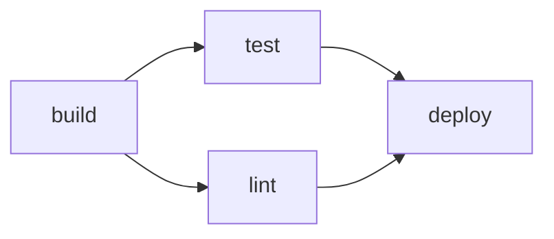

# wetwire-github-go Implementation Plan & Roadmap

## Overview

Build `wetwire-github-go` following the same patterns as `wetwire-aws-go` — a synthesis library that generates GitHub YAML configurations from typed Go declarations.

For the wetwire pattern, see the [Wetwire Specification](https://github.com/lex00/wetwire/blob/main/docs/WETWIRE_SPEC.md).

---

## The "No Parens" Pattern

All declarations use struct literals — no function calls or registration:

```go
// Importer generates flat variables with correct & based on field types
var CIPush = workflow.PushTrigger{Branches: List("main")}

// Clean references at usage site
var CI = workflow.Workflow{Name: "CI", On: workflow.Triggers{Push: CIPush}}
var Build = workflow.Job{Name: "build", RunsOn: "ubuntu-latest", Steps: BuildSteps}
var Deploy = workflow.Job{Needs: []any{Build, Test}}

// Type-safe action wrappers
checkout.Checkout{FetchDepth: 0}.ToStep()

// Expression contexts
workflow.Secrets.Get("TOKEN")
workflow.Matrix.Get("os")
workflow.GitHub.Ref
```

**Generated package structure:** Single package per project, flat variables, cross-file references via package scope. Importer handles `&` syntax automatically.

AST-based discovery — no registration needed.

**Key principles:**
- Variables declared with struct literals (no function calls)
- Pointer types declared once with `&`, referenced cleanly without `&`
- Cross-resource references via direct field access
- AST-based discovery — no registration needed
- Type-safe action wrappers with `.ToStep()` conversion
- Expression contexts as typed accessors (`workflow.Secrets.Get(...)`)

---

## Scope

wetwire-github-go generates typed Go declarations for three GitHub YAML configuration types:

| Config Type | Output Location | Schema Source |
|-------------|-----------------|---------------|
| **GitHub Actions** | `.github/workflows/*.yml` | `json.schemastore.org/github-workflow.json` |
| **Dependabot** | `.github/dependabot.yml` | `json.schemastore.org/dependabot-2.0.json` |
| **Issue/Discussion Templates** | `.github/ISSUE_TEMPLATE/*.yml` | `json.schemastore.org/github-issue-forms.json` |

---

## Key Decisions

- **Action versions**: Hardcode major version in generated wrappers (e.g., `@v4`)
- **Validation**: Use actionlint as Go library (`github.com/rhysd/actionlint`)
- **Approach**: Full feature parity with wetwire-aws-go
- **Config types**: Support Actions, Dependabot, and Issue/Discussion Templates via `--type` flag

---

## Feature Matrix: wetwire-aws-go → wetwire-github-go

| Feature | wetwire-aws-go | wetwire-github-go |
|---------|----------------|-------------------|
| **Schema Source** | CloudFormation spec JSON | Workflow JSON schema + action.yml files |
| **Schema URL** | AWS CF spec URL | `json.schemastore.org/github-workflow.json` |
| **Secondary Source** | — | Popular action.yml files (checkout, setup-python, etc.) |
| **Output Format** | CloudFormation JSON/YAML | GitHub Actions workflow YAML |
| **Generated Types** | 262 AWS service packages | Workflow, Job, Step, Matrix, Triggers + Action wrappers |
| **Intrinsics** | Ref, GetAtt, Sub, Join, etc. | Expression contexts (github, runner, env, secrets, matrix) |
| **Validation** | cfn-lint integration | actionlint integration |

---

## Schema Sources

### 1. Workflow Schema
- **URL**: `https://json.schemastore.org/github-workflow.json`
- **Raw**: `https://raw.githubusercontent.com/SchemaStore/schemastore/master/src/schemas/json/github-workflow.json`
- **Provides**: Triggers, jobs, steps, matrix, concurrency, permissions, environments

### 2. Action Metadata (action.yml)
- **Pattern**: `https://raw.githubusercontent.com/{owner}/{repo}/main/action.yml`
- **Popular actions to generate wrappers for**:
  - `actions/checkout`
  - `actions/setup-python`, `setup-node`, `setup-go`, `setup-java`
  - `actions/cache`
  - `actions/upload-artifact`, `download-artifact`
  - `docker/build-push-action`
  - `codecov/codecov-action`
  - `pypa/gh-action-pypi-publish`
  - (extensible list in config)

### 3. Dependabot Schema
- **URL**: `https://json.schemastore.org/dependabot-2.0.json`
- **Provides**: Package ecosystems, update schedules, registries, groups, ignore patterns

### 4. Issue Forms Schema
- **URL**: `https://json.schemastore.org/github-issue-forms.json`
- **Provides**: Form body elements (input, textarea, dropdown, checkboxes, markdown)

---

## Generated Package Structure (User Projects)

When users run `wetwire-github import` or `wetwire-github init`, the importer scaffolds a project package:

```
my-ci/                           # User's workflow package
├── go.mod                       # Module: my-ci
├── go.sum
├── README.md                    # Generated docs
├── CLAUDE.md                    # AI assistant context
├── .gitignore
│
├── cmd/
│   └── main.go                  # Usage instructions
│
├── workflows.go                 # Workflow declarations
├── jobs.go                      # Job declarations
├── steps.go                     # Reusable step declarations
├── triggers.go                  # Trigger configurations
└── matrix.go                    # Matrix configurations
```

**Key patterns (same as wetwire-aws-go):**
- Single package per project
- Flat variables for all nested structs
- Importer generates correct `&` based on field types
- Cross-file references work via Go's package scope
- Variables reference each other directly (e.g., `Steps: BuildSteps`)

---

## Library Directory Structure

```
wetwire-github-go/
├── .github/
│   └── workflows/
│       ├── ci.yml              # Build/test on push/PR
│       └── codebot.yml         # Claude Code integration
│
├── scripts/
│   ├── ci.sh                   # Local CI runner
│   └── import_samples.sh       # Round-trip testing
│
├── cmd/wetwire-github/         # CLI application
│   ├── main.go
│   ├── build.go                # Generate YAML (--type workflow|dependabot|issue-template)
│   ├── validate.go             # Validate via actionlint
│   ├── list.go                 # List discovered resources
│   ├── lint.go                 # Code quality rules
│   ├── import.go               # YAML → Go conversion
│   ├── init.go                 # Project scaffolding
│   └── version.go
│
├── internal/
│   ├── discover/               # AST-based resource discovery
│   ├── importer/               # YAML to Go code conversion
│   ├── linter/                 # Go code lint rules (WAG001-WAG0XX)
│   ├── template/               # YAML builder
│   ├── serialize/              # YAML serialization
│   └── validation/             # actionlint integration
│
├── workflow/                   # Core workflow types (hand-written)
│   ├── workflow.go             # Workflow struct
│   ├── job.go                  # Job struct
│   ├── step.go                 # Step struct
│   ├── matrix.go               # Matrix builder
│   ├── triggers.go             # Push, PullRequest, Schedule, etc.
│   ├── conditions.go           # Condition builders
│   └── expressions.go          # github, runner, env, secrets contexts
│
├── dependabot/                 # Dependabot types (hand-written)
│   ├── dependabot.go           # Dependabot struct
│   ├── update.go               # Update struct
│   ├── schedule.go             # Schedule struct
│   ├── registries.go           # Registry types
│   └── groups.go               # Grouping configuration
│
├── templates/                  # Issue/Discussion template types (hand-written)
│   ├── issue.go                # IssueTemplate struct
│   ├── discussion.go           # DiscussionTemplate struct
│   ├── form.go                 # FormBody struct
│   └── elements.go             # Input, Textarea, Dropdown, Checkboxes, Markdown
│
├── actions/                    # GENERATED action wrappers
│   ├── checkout/
│   │   └── checkout.go         # Typed wrapper for actions/checkout
│   ├── setup_python/
│   │   └── setup_python.go
│   ├── cache/
│   └── ... (top 20+ actions)
│
├── codegen/                    # Code generation tooling
│   ├── fetch.go                # Download schemas + action.yml
│   ├── parse.go                # Parse schemas
│   └── generate.go             # Generate Go types
│
├── examples/                   # Example configs for import testing
│   └── (fetched from real repos)
│
├── docs/
│   ├── ROADMAP.md              # This file
│   ├── FAQ.md
│   ├── QUICK_START.md
│   ├── CLI.md
│   └── IMPORT_WORKFLOW.md
│
├── specs/                      # .gitignore'd (fetched schemas)
│   ├── .gitkeep
│   ├── manifest.json
│   ├── workflow-schema.json
│   ├── dependabot-schema.json
│   ├── issue-forms-schema.json
│   └── actions/
│       ├── checkout.yml
│       └── ...
│
├── contracts.go                # Interfaces and types
├── go.mod
└── README.md
```

---

## CLI Commands

### 1. `wetwire-github build`
- Discover workflow declarations from Go packages
- Serialize to GitHub Actions YAML
- Output to `.github/workflows/` or custom path

### 2. `wetwire-github validate`
- Run actionlint on generated YAML (via Go library)
- Report errors in structured format (text/JSON)

### 3. `wetwire-github list`
- List discovered workflows and jobs
- Show file locations and dependencies

### 4. `wetwire-github lint`
- Go code quality rules (WAG001-WAG0XX)
- Examples:
  - WAG001: Use typed action wrappers instead of raw `uses:` strings
  - WAG002: Use condition builders instead of raw expression strings
  - WAG003: Use secrets context instead of hardcoded strings
  - WAG004: Use matrix builder instead of inline maps

### 5. `wetwire-github import`
- Convert existing workflow YAML to Go code
- Generate typed declarations
- Scaffold project structure

### 6. `wetwire-github init`
- Create new project with example workflow
- Generate go.mod, main.go, workflow definitions

### 7. `wetwire-github design`
- AI-assisted infrastructure design via wetwire-core-go
- Interactive session with lint feedback loop

### 8. `wetwire-github test`
- Persona-based testing via wetwire-core-go
- Automated evaluation of code generation quality

### 9. `wetwire-github graph`
- Generate DAG visualization of workflow jobs
- Uses `github.com/emicklei/dot` library
- Formats: `--format dot` (Graphviz), `--format mermaid` (GitHub markdown)

---

## CLI Exit Codes

Per the wetwire specification, CLI commands use consistent exit codes:

| Command | Exit 0 | Exit 1 | Exit 2 |
|---------|--------|--------|--------|
| `build` | Success | Error (parse, generation) | — |
| `lint` | No issues | Issues found | Error (parse failure) |
| `import` | Success | Error (parse, generation) | — |
| `validate` | Valid | Invalid (actionlint errors) | Error (file not found) |
| `list` | Success | Error | — |
| `init` | Success | Error (dir exists, write fail) | — |

---

## Contracts (contracts.go)

Core interfaces and types (mirroring wetwire-aws-go pattern):

```go
// WorkflowResource represents a GitHub workflow resource.
// All resource types (Workflow, Job) implement this interface.
type WorkflowResource interface {
    ResourceType() string  // e.g., "workflow", "job"
}

// OutputRef represents a reference to a step output.
// When serialized to YAML, becomes: ${{ steps.step_id.outputs.name }}
type OutputRef struct {
    StepID string
    Output string
}

func (o OutputRef) String() string {
    return fmt.Sprintf("${{ steps.%s.outputs.%s }}", o.StepID, o.Output)
}

// DiscoveredWorkflow represents a workflow found by AST parsing.
type DiscoveredWorkflow struct {
    Name         string   // Variable name
    File         string   // Source file path
    Line         int      // Line number
    Jobs         []string // Job variable names in this workflow
}

// DiscoveredJob represents a job found by AST parsing.
type DiscoveredJob struct {
    Name         string   // Variable name
    File         string   // Source file path
    Line         int      // Line number
    Dependencies []string // Referenced job names (Needs field)
}

// Result types for CLI JSON output
type BuildResult struct {
    Success   bool     `json:"success"`
    Workflows []string `json:"workflows,omitempty"`
    Files     []string `json:"files,omitempty"`
    Errors    []string `json:"errors,omitempty"`
}

type LintResult struct {
    Success bool        `json:"success"`
    Issues  []LintIssue `json:"issues,omitempty"`
}

type LintIssue struct {
    File     string `json:"file"`
    Line     int    `json:"line"`
    Column   int    `json:"column"`
    Severity string `json:"severity"`
    Message  string `json:"message"`
    Rule     string `json:"rule"`
    Fixable  bool   `json:"fixable"`
}

type ValidateResult struct {
    Success  bool     `json:"success"`
    Errors   []string `json:"errors,omitempty"`
    Warnings []string `json:"warnings,omitempty"`
}

type ListResult struct {
    Workflows []ListWorkflow `json:"workflows"`
}

type ListWorkflow struct {
    Name string `json:"name"`
    File string `json:"file"`
    Line int    `json:"line"`
    Jobs int    `json:"jobs"`
}
```

---

## Core Types (workflow/ package)

Types designed for the "no parens" pattern — struct literal initialization:

```go
// workflow.go
type Workflow struct {
    Name        string                 `yaml:"name,omitempty"`
    On          Triggers               `yaml:"on"`
    Env         map[string]any         `yaml:"env,omitempty"`
    Defaults    *Defaults              `yaml:"defaults,omitempty"`
    Concurrency *Concurrency           `yaml:"concurrency,omitempty"`
    Permissions *Permissions           `yaml:"permissions,omitempty"`
    Jobs        map[string]Job         `yaml:"jobs"` // populated by discovery
}

// job.go
type Job struct {
    Outputs map[string]OutputRef `yaml:"-"` // excluded from YAML, used for refs

    Name           string              `yaml:"name,omitempty"`
    RunsOn         any                 `yaml:"runs-on"`
    Needs          []any               `yaml:"needs,omitempty"` // Job references
    If             any                 `yaml:"if,omitempty"`
    Environment    *Environment        `yaml:"environment,omitempty"`
    Concurrency    *Concurrency        `yaml:"concurrency,omitempty"`
    Strategy       *Strategy           `yaml:"strategy,omitempty"`
    Container      *Container          `yaml:"container,omitempty"`
    Services       map[string]Service  `yaml:"services,omitempty"`
    Steps          []Step              `yaml:"steps"`
    TimeoutMinutes int                 `yaml:"timeout-minutes,omitempty"`
}

// step.go
type Step struct {
    ID      string         `yaml:"id,omitempty"`
    Name    string         `yaml:"name,omitempty"`
    If      any            `yaml:"if,omitempty"`
    Uses    string         `yaml:"uses,omitempty"`
    With    map[string]any `yaml:"with,omitempty"`
    Run     string         `yaml:"run,omitempty"`
    Shell   string         `yaml:"shell,omitempty"`
    Env     map[string]any `yaml:"env,omitempty"`
    WorkingDirectory string `yaml:"working-directory,omitempty"`
}

// Output returns an OutputRef for referencing this step's outputs
func (s Step) Output(name string) OutputRef {
    return OutputRef{StepID: s.ID, Output: name}
}

// triggers.go
type Triggers struct {
    Push              *PushTrigger              `yaml:"push,omitempty"`
    PullRequest       *PullRequestTrigger       `yaml:"pull_request,omitempty"`
    PullRequestTarget *PullRequestTargetTrigger `yaml:"pull_request_target,omitempty"`
    Schedule          []ScheduleTrigger         `yaml:"schedule,omitempty"`
    WorkflowDispatch  *WorkflowDispatchTrigger  `yaml:"workflow_dispatch,omitempty"`
    WorkflowCall      *WorkflowCallTrigger      `yaml:"workflow_call,omitempty"`
    // ... 30+ event types
}

// matrix.go
type Strategy struct {
    Matrix      *Matrix `yaml:"matrix,omitempty"`
    FailFast    *bool   `yaml:"fail-fast,omitempty"`
    MaxParallel int     `yaml:"max-parallel,omitempty"`
}

type Matrix struct {
    Values  map[string][]any   `yaml:",inline"`
    Include []map[string]any   `yaml:"include,omitempty"`
    Exclude []map[string]any   `yaml:"exclude,omitempty"`
}
```

---

## Helper Types (workflow/helpers.go)

```go
// Env is a shorthand for map[string]any.
type Env = map[string]any

// With is a shorthand for map[string]any.
type With = map[string]any

// List creates a typed slice from items.
func List[T any](items ...T) []T { return items }

// Strings creates a []string slice.
func Strings(items ...string) []string { return items }

// Ptr returns a pointer to the value.
func Ptr[T any](v T) *T { return &v }
```

---

## Expression Contexts (workflow/expressions.go)

```go
// Expression wraps a GitHub Actions expression string
type Expression string

func (e Expression) String() string {
    return fmt.Sprintf("${{ %s }}", string(e))
}

// Context accessors - used like: workflow.Secrets.Get("TOKEN")
var GitHub = githubContext{}
var Runner = runnerContext{}
var Env = envContext{}
var Secrets = secretsContext{}
var Matrix = matrixContext{}
var Steps = stepsContext{}
var Needs = needsContext{}

type secretsContext struct{}
func (secretsContext) Get(name string) Expression {
    return Expression(fmt.Sprintf("secrets.%s", name))
}

type matrixContext struct{}
func (matrixContext) Get(name string) Expression {
    return Expression(fmt.Sprintf("matrix.%s", name))
}

type githubContext struct{}
func (githubContext) Ref() Expression     { return Expression("github.ref") }
func (githubContext) SHA() Expression     { return Expression("github.sha") }
func (githubContext) Actor() Expression   { return Expression("github.actor") }
func (githubContext) EventName() Expression { return Expression("github.event_name") }

// Condition builders
func Always() Expression  { return Expression("always()") }
func Failure() Expression { return Expression("failure()") }
func Success() Expression { return Expression("success()") }
func Cancelled() Expression { return Expression("cancelled()") }

func Branch(name string) Expression {
    return Expression(fmt.Sprintf("github.ref == 'refs/heads/%s'", name))
}

// Composable conditions
func (e Expression) And(other Expression) Expression {
    return Expression(fmt.Sprintf("(%s) && (%s)", e, other))
}

func (e Expression) Or(other Expression) Expression {
    return Expression(fmt.Sprintf("(%s) || (%s)", e, other))
}
```

---

## Generated Action Wrappers (actions/ package)

```go
// actions/checkout/checkout.go
// Code generated by wetwire-github codegen. DO NOT EDIT.
// Source: actions/checkout/action.yml

package checkout

import (
    wetwire "github.com/lex00/wetwire-github-go"
    "github.com/lex00/wetwire-github-go/workflow"
)

// Checkout represents actions/checkout@v4
type Checkout struct {
    // Outputs for cross-step references (like AttrRef in wetwire-aws-go)
    RefOutput    wetwire.OutputRef `yaml:"-"`
    CommitOutput wetwire.OutputRef `yaml:"-"`

    // Inputs (from action.yml)
    Repository         string `yaml:"repository,omitempty"`
    Ref                string `yaml:"ref,omitempty"`
    Token              string `yaml:"token,omitempty"`
    SSHKey             string `yaml:"ssh-key,omitempty"`
    PersistCredentials *bool  `yaml:"persist-credentials,omitempty"`
    Path               string `yaml:"path,omitempty"`
    Clean              *bool  `yaml:"clean,omitempty"`
    FetchDepth         int    `yaml:"fetch-depth,omitempty"`
    FetchTags          *bool  `yaml:"fetch-tags,omitempty"`
    Submodules         string `yaml:"submodules,omitempty"`
    LFS                *bool  `yaml:"lfs,omitempty"`
}

// Action returns the action reference string
func (a Checkout) Action() string { return "actions/checkout@v4" }

// ToStep converts to a workflow.Step for use in Steps slice
func (a Checkout) ToStep() workflow.Step {
    return workflow.Step{
        Uses: a.Action(),
        With: a.toWith(),
    }
}

// ToStepWithID converts to a workflow.Step with an ID for output references
func (a Checkout) ToStepWithID(id string) workflow.Step {
    return workflow.Step{
        ID:   id,
        Uses: a.Action(),
        With: a.toWith(),
    }
}
```

---

## Integration with wetwire-core-go

Same pattern as wetwire-aws-go:

```go
// RunnerAgent tools for wetwire-github
tools := []Tool{
    "init_package",      // wetwire-github init
    "write_file",        // Write Go workflow code
    "read_file",         // Read files
    "run_lint",          // wetwire-github lint --format json
    "run_build",         // wetwire-github build --format json
    "run_validate",      // wetwire-github validate (actionlint)
    "ask_developer",     // Clarification questions
}
```

CLI must support `--format json` for agent integration.

### Agent Tool Contract

Per the [wetwire specification](https://github.com/lex00/wetwire/blob/main/docs/WETWIRE_SPEC.md), RunnerAgent tools MUST map to CLI commands:

| Tool | CLI Command | Description |
|------|-------------|-------------|
| `init_package` | `wetwire-github init <name> -o <dir>` | Create new project scaffold |
| `write_file` | (direct file write) | Write Go workflow code |
| `read_file` | (direct file read) | Read existing files |
| `run_lint` | `wetwire-github lint --format json <path>` | Check code quality |
| `run_build` | `wetwire-github build --format json <path>` | Generate YAML output |
| `run_validate` | `wetwire-github validate --format json <path>` | Validate via actionlint |
| `ask_developer` | (conversation) | Request clarification from user |

---

## Actionlint Integration (Go Library)

```go
// internal/validation/actionlint.go
import "github.com/rhysd/actionlint"

func ValidateWorkflow(path string, content []byte) (*ValidationResult, error) {
    linter, _ := actionlint.NewLinter(io.Discard, nil)
    errs, _ := linter.Lint(path, content, nil)

    result := &ValidationResult{Success: len(errs) == 0}
    for _, e := range errs {
        result.Issues = append(result.Issues, ValidationIssue{
            File:     e.Filepath,
            Line:     e.Line,
            Column:   e.Column,
            Message:  e.Message,
            RuleID:   e.Kind,
        })
    }
    return result, nil
}
```

No external CLI dependency required.

---

## Development Infrastructure (Phase 0)

Project setup and CI/CD infrastructure (mirroring wetwire-aws-go):

| Feature | File/Location | Status |
|---------|---------------|--------|
| **Repository Setup** | | |
| ├─ go.mod with dependencies | `go.mod` | [ ] |
| ├─ .gitignore (Go project) | `.gitignore` | [ ] |
| ├─ specs/.gitkeep | `specs/.gitkeep` | [ ] |
| └─ specs in .gitignore | `.gitignore` | [ ] |
| **GitHub Actions CI** | | |
| ├─ ci.yml (build/test on push/PR) | `.github/workflows/ci.yml` | [ ] |
| └─ codebot.yml (Claude Code integration) | `.github/workflows/codebot.yml` | [ ] |
| **Development Scripts** | | |
| ├─ ci.sh (local CI runner) | `scripts/ci.sh` | [ ] |
| └─ import_samples.sh (round-trip testing) | `scripts/import_samples.sh` | [ ] |
| **Documentation** | | |
| ├─ README.md (full) | `README.md` | [ ] |
| ├─ QUICK_START.md | `docs/QUICK_START.md` | [ ] |
| ├─ CLI.md | `docs/CLI.md` | [ ] |
| └─ IMPORT_WORKFLOW.md | `docs/IMPORT_WORKFLOW.md` | [ ] |
| **Build Artifacts** | | |
| └─ codegen-bin (pre-built binary) | `codegen-bin` | [ ] |

---

## Feature Matrix

| Feature | Phase | Status | Dependencies |
|---------|-------|--------|--------------|
| **Core Types** | | | |
| ├─ Workflow struct | 1A | [ ] | — |
| ├─ Job struct | 1A | [ ] | — |
| ├─ Step struct | 1A | [ ] | — |
| ├─ Matrix struct | 1A | [ ] | — |
| ├─ Triggers (all 30+ types) | 1A | [ ] | — |
| ├─ WorkflowCallTrigger (reusable workflows) | 1A | [ ] | — |
| ├─ WorkflowInput/Output/Secret types | 1A | [ ] | — |
| ├─ Conditions interface | 1A | [ ] | — |
| ├─ Expression contexts | 1A | [ ] | — |
| ├─ Helper types (Env, With, List, Strings, Ptr) | 1A | [ ] | — |
| ├─ contracts.go (interfaces) | 1A | [ ] | — |
| ├─ Result types (Build/Lint/Validate/List) | 1A | [ ] | — |
| └─ DiscoveredWorkflow/Job structs | 1A | [ ] | — |
| **Serialization** | | | |
| ├─ Workflow → YAML | 1B | [ ] | Core Types |
| ├─ Job → YAML | 1B | [ ] | Core Types |
| ├─ Step → YAML | 1B | [ ] | Core Types |
| ├─ Matrix → YAML | 1B | [ ] | Core Types |
| ├─ Triggers → YAML | 1B | [ ] | Core Types |
| ├─ Reusable workflow (workflow_call) → YAML | 1B | [ ] | Core Types |
| ├─ Conditions → expression strings | 1B | [ ] | Core Types |
| ├─ Struct → map serialization | 1B | [ ] | Core Types |
| ├─ PascalCase/snake_case conversion | 1B | [ ] | — |
| └─ Zero value omission | 1B | [ ] | — |
| **CLI Framework** | | | |
| ├─ main.go + cobra setup | 1C | [ ] | — |
| ├─ `init` command | 1C | [ ] | — |
| ├─ `build` command (stub) | 1C | [ ] | — |
| ├─ `validate` command (stub) | 1C | [ ] | — |
| ├─ `list` command (stub) | 1C | [ ] | — |
| ├─ `lint` command (stub) | 1C | [ ] | — |
| ├─ `import` command (stub) | 1C | [ ] | — |
| ├─ `design` command (stub) | 1C | [ ] | — |
| ├─ `test` command (stub) | 1C | [ ] | — |
| ├─ `graph` command (stub) | 1C | [ ] | — |
| ├─ `version` command | 1C | [ ] | — |
| └─ Exit code semantics (0/1/2) | 1C | [ ] | — |
| **Schema Fetching** | | | |
| ├─ HTTP fetcher with retry | 1D | [ ] | — |
| ├─ Workflow schema fetch | 1D | [ ] | — |
| ├─ Action.yml fetch (checkout) | 1D | [ ] | — |
| ├─ Action.yml fetch (setup-python) | 1D | [ ] | — |
| ├─ Action.yml fetch (setup-node) | 1D | [ ] | — |
| ├─ Action.yml fetch (setup-go) | 1D | [ ] | — |
| ├─ Action.yml fetch (cache) | 1D | [ ] | — |
| ├─ Action.yml fetch (upload-artifact) | 1D | [ ] | — |
| ├─ Action.yml fetch (download-artifact) | 1D | [ ] | — |
| └─ specs/manifest.json | 1D | [ ] | — |
| **Schema Parsing** | | | |
| ├─ Workflow schema parser | 2A | [ ] | Schema Fetching |
| ├─ Action.yml parser | 2A | [ ] | Schema Fetching |
| └─ Intermediate representation | 2A | [ ] | Schema Fetching |
| **Action Codegen** | | | |
| ├─ Generator templates | 2B | [ ] | Schema Parsing |
| ├─ Code formatting (go/format) | 2B | [ ] | — |
| ├─ actions/checkout wrapper | 2B | [ ] | Schema Parsing |
| ├─ actions/setup_python wrapper | 2B | [ ] | Schema Parsing |
| ├─ actions/setup_node wrapper | 2B | [ ] | Schema Parsing |
| ├─ actions/setup_go wrapper | 2B | [ ] | Schema Parsing |
| ├─ actions/cache wrapper | 2B | [ ] | Schema Parsing |
| ├─ actions/upload_artifact wrapper | 2B | [ ] | Schema Parsing |
| ├─ actions/download_artifact wrapper | 2B | [ ] | Schema Parsing |
| └─ Composite action wrapper support | 2B | [ ] | Schema Parsing |
| **AST Discovery** | | | |
| ├─ Package scanning (go/parser) | 2C | [ ] | Core Types |
| ├─ Workflow variable detection | 2C | [ ] | Core Types |
| ├─ Job variable detection | 2C | [ ] | Core Types |
| ├─ Dependency graph building | 2C | [ ] | Core Types |
| ├─ Reference validation | 2C | [ ] | Core Types |
| ├─ Recursive directory traversal | 2C | [ ] | — |
| └─ Vendor/hidden directory exclusion | 2C | [ ] | — |
| **Runner (Value Extraction)** | | | |
| ├─ Temp Go program generation | 2G | [ ] | AST Discovery |
| ├─ go.mod parsing | 2G | [ ] | — |
| ├─ Replace directive handling | 2G | [ ] | — |
| ├─ Go binary discovery | 2G | [ ] | — |
| └─ JSON value extraction | 2G | [ ] | — |
| **Template Builder** | | | |
| ├─ Topological sort (Kahn's algorithm) | 2H | [ ] | AST Discovery |
| ├─ Cycle detection | 2H | [ ] | AST Discovery |
| └─ Dependency ordering | 2H | [ ] | AST Discovery |
| **Build Command (full)** | | | |
| ├─ Discovery integration | 3A | [ ] | AST Discovery |
| ├─ Runner integration | 3A | [ ] | Runner |
| ├─ Template builder integration | 3A | [ ] | Template Builder |
| ├─ Multi-workflow support | 3A | [ ] | Serialization |
| ├─ Output to `.github/workflows/` | 3A | [ ] | Serialization |
| ├─ --format json/yaml | 3A | [ ] | — |
| └─ --output flag | 3A | [ ] | — |
| **Validation (actionlint)** | | | |
| ├─ actionlint Go library integration | 2D | [ ] | — |
| ├─ ValidationResult types | 2D | [ ] | — |
| ├─ Multiple validator pipeline | 2D | [ ] | — |
| └─ `validate` command (full) | 3B | [ ] | actionlint integration |
| **Linting Rules** | | | |
| ├─ Linter framework | 2E | [ ] | — |
| ├─ Rule interface (ID, Description, Check) | 2E | [ ] | — |
| ├─ WAG001: typed action wrappers | 2E | [ ] | — |
| ├─ WAG002: condition builders | 2E | [ ] | — |
| ├─ WAG003: secrets context | 2E | [ ] | — |
| ├─ WAG004: matrix builder | 2E | [ ] | — |
| ├─ WAG005: inline structs → named vars | 2E | [ ] | — |
| ├─ WAG006: duplicate workflow names | 2E | [ ] | — |
| ├─ WAG007: file too large (>N jobs) | 2E | [ ] | — |
| ├─ WAG008: hardcoded expression strings | 2E | [ ] | — |
| ├─ Recursive package scanning | 2E | [ ] | — |
| ├─ --fix flag support | 2E | [ ] | — |
| └─ `lint` command (full) | 3C | [ ] | Linter framework |
| **Import (YAML → Go)** | | | |
| ├─ YAML parser | 2F | [ ] | — |
| ├─ IR (intermediate representation) | 2F | [ ] | — |
| ├─ IRWorkflow, IRJob, IRStep structs | 2F | [ ] | — |
| ├─ Reference graph tracking | 2F | [ ] | — |
| ├─ Go code generator | 3D | [ ] | YAML parser, Core Types |
| ├─ Field name transformation | 3D | [ ] | — |
| ├─ Reserved name handling | 3D | [ ] | — |
| ├─ Scaffold: go.mod | 3D | [ ] | — |
| ├─ Scaffold: cmd/main.go | 3D | [ ] | — |
| ├─ Scaffold: README.md | 3D | [ ] | — |
| ├─ Scaffold: CLAUDE.md | 3D | [ ] | — |
| ├─ Scaffold: .gitignore | 3D | [ ] | — |
| ├─ --single-file flag | 3D | [ ] | — |
| ├─ --no-scaffold flag | 3D | [ ] | — |
| ├─ Local action wrapper generation | 3D | [ ] | Action Codegen |
| └─ `import` command (full) | 3D | [ ] | Go code generator |
| **List Command** | | | |
| ├─ Table output format | 3E | [ ] | AST Discovery |
| ├─ --format json | 3E | [ ] | — |
| └─ `list` command (full) | 3E | [ ] | AST Discovery |
| **Graph Command (DAG Visualization)** | | | |
| ├─ github.com/emicklei/dot integration | 3H | [ ] | AST Discovery |
| ├─ DOT format output | 3H | [ ] | — |
| ├─ Mermaid format output | 3H | [ ] | — |
| ├─ Job dependency edge extraction | 3H | [ ] | AST Discovery |
| └─ `graph` command (full) | 3H | [ ] | AST Discovery |
| **Design Command (AI-assisted)** | | | |
| ├─ wetwire-core-go orchestrator | 3F | [ ] | All CLI commands |
| ├─ Interactive session | 3F | [ ] | — |
| ├─ --stream flag | 3F | [ ] | — |
| ├─ --max-lint-cycles flag | 3F | [ ] | — |
| └─ `design` command (full) | 3F | [ ] | wetwire-core-go |
| **Test Command (Persona-based)** | | | |
| ├─ Persona selection | 3G | [ ] | wetwire-core-go |
| ├─ Scenario configuration | 3G | [ ] | — |
| ├─ Result writing | 3G | [ ] | — |
| ├─ Session tracking | 3G | [ ] | — |
| └─ `test` command (full) | 3G | [ ] | wetwire-core-go |
| **Reference Example Testing** | | | |
| ├─ Fetch starter-workflows | 4A | [ ] | Schema Fetching |
| ├─ Import/rebuild cycle tests | 4A | [ ] | Import, Build |
| ├─ Round-trip validation | 4A | [ ] | Import, Build, Validate |
| └─ Success rate tracking | 4A | [ ] | — |
| **wetwire-core-go Integration** | | | |
| ├─ RunnerAgent tool definitions | 4B | [ ] | All CLI commands |
| ├─ Tool handlers implementation | 4B | [ ] | — |
| ├─ Stream handler support | 4B | [ ] | — |
| ├─ Session result writing | 4B | [ ] | — |
| ├─ Scoring integration | 4B | [ ] | — |
| └─ Agent testing with personas | 4B | [ ] | — |
| **Dependabot Types** | | | |
| ├─ Dependabot struct | 5A | [ ] | — |
| ├─ Update struct | 5A | [ ] | — |
| ├─ Schedule struct | 5A | [ ] | — |
| ├─ PackageEcosystem enum | 5A | [ ] | — |
| ├─ Registries struct | 5A | [ ] | — |
| ├─ Groups struct | 5A | [ ] | — |
| └─ contracts (Dependabot) | 5A | [ ] | — |
| **Dependabot Schema** | | | |
| ├─ Fetch dependabot-2.0.json | 5A | [ ] | — |
| ├─ Parse dependabot schema | 5A | [ ] | — |
| └─ Dependabot → YAML serialization | 5A | [ ] | — |
| **Dependabot CLI** | | | |
| ├─ `build --type dependabot` | 5A | [ ] | Dependabot Types |
| ├─ `import --type dependabot` | 5A | [ ] | Dependabot Types |
| ├─ `validate --type dependabot` | 5A | [ ] | — |
| └─ AST discovery for Dependabot | 5A | [ ] | Dependabot Types |
| **Issue Template Types** | | | |
| ├─ IssueTemplate struct | 5B | [ ] | — |
| ├─ FormBody struct | 5B | [ ] | — |
| ├─ FormElement interface | 5B | [ ] | — |
| ├─ Input element | 5B | [ ] | — |
| ├─ Textarea element | 5B | [ ] | — |
| ├─ Dropdown element | 5B | [ ] | — |
| ├─ Checkboxes element | 5B | [ ] | — |
| ├─ Markdown element | 5B | [ ] | — |
| └─ contracts (IssueTemplate) | 5B | [ ] | — |
| **Issue Template Schema** | | | |
| ├─ Fetch github-issue-forms.json | 5B | [ ] | — |
| ├─ Parse issue forms schema | 5B | [ ] | — |
| └─ IssueTemplate → YAML serialization | 5B | [ ] | — |
| **Issue Template CLI** | | | |
| ├─ `build --type issue-template` | 5B | [ ] | IssueTemplate Types |
| ├─ `import --type issue-template` | 5B | [ ] | IssueTemplate Types |
| ├─ `validate --type issue-template` | 5B | [ ] | — |
| └─ AST discovery for IssueTemplate | 5B | [ ] | IssueTemplate Types |
| **Discussion Template Types** | | | |
| ├─ DiscussionTemplate struct | 5C | [ ] | FormBody (from 5B) |
| └─ Discussion category handling | 5C | [ ] | — |
| **Discussion Template CLI** | | | |
| ├─ `build --type discussion-template` | 5C | [ ] | DiscussionTemplate Types |
| └─ `import --type discussion-template` | 5C | [ ] | DiscussionTemplate Types |

---

## Phased Implementation

### Phase 1: Foundation (Parallel Streams)

All Phase 1 work streams can be developed **in parallel** with no dependencies on each other.

```
┌─────────────────────────────────────────────────────────────────────────┐
│ PHASE 1: Foundation                                                      │
├─────────────────────────────────────────────────────────────────────────┤
│                                                                          │
│  ┌──────────────┐  ┌──────────────┐  ┌──────────────┐  ┌──────────────┐ │
│  │     1A       │  │     1B       │  │     1C       │  │     1D       │ │
│  │  Core Types  │  │ Serialization│  │     CLI      │  │Schema Fetch  │ │
│  │              │  │              │  │  Framework   │  │              │ │
│  │  workflow/   │  │  internal/   │  │    cmd/      │  │  codegen/    │ │
│  │  *.go        │  │  serialize/  │  │  wetwire-    │  │  fetch.go    │ │
│  │              │  │              │  │  github/     │  │              │ │
│  └──────────────┘  └──────────────┘  └──────────────┘  └──────────────┘ │
│         │                 │                 │                 │         │
│         │                 │                 │                 │         │
│         ▼                 ▼                 ▼                 ▼         │
│    No deps           Needs 1A          No deps           No deps       │
│                      (can stub)                                         │
└─────────────────────────────────────────────────────────────────────────┘
```

### Phase 2: Core Capabilities (Parallel Streams)

Phase 2 streams have dependencies on Phase 1 but are **parallel to each other**.

```
┌─────────────────────────────────────────────────────────────────────────┐
│ PHASE 2: Core Capabilities                                               │
├─────────────────────────────────────────────────────────────────────────┤
│                                                                          │
│  ┌────────┐ ┌────────┐ ┌────────┐ ┌────────┐ ┌────────┐ ┌────────┐     │
│  │   2A   │ │   2B   │ │   2C   │ │   2D   │ │   2E   │ │   2F   │     │
│  │ Schema │ │ Action │ │  AST   │ │action- │ │ Linter │ │  YAML  │     │
│  │ Parse  │ │Codegen │ │Discover│ │  lint  │ │ Rules  │ │ Parser │     │
│  └───┬────┘ └───┬────┘ └───┬────┘ └───┬────┘ └───┬────┘ └───┬────┘     │
│      │          │          │          │          │          │          │
│      ▼          ▼          ▼          ▼          ▼          ▼          │
│   Needs 1D  Needs 2A   Needs 1A   No deps    No deps    No deps        │
│                                                                          │
│  ┌────────┐ ┌────────┐                                                  │
│  │   2G   │ │   2H   │                                                  │
│  │ Runner │ │Template│                                                  │
│  │  Value │ │Builder │                                                  │
│  └───┬────┘ └───┬────┘                                                  │
│      │          │                                                        │
│      ▼          ▼                                                        │
│   Needs 2C  Needs 2C                                                    │
└─────────────────────────────────────────────────────────────────────────┘
```

### Phase 3: Command Integration (Parallel Streams)

Phase 3 integrates Phase 2 capabilities into CLI commands. Each command can be completed **in parallel**.

```
┌─────────────────────────────────────────────────────────────────────────┐
│ PHASE 3: Command Integration                                             │
├─────────────────────────────────────────────────────────────────────────┤
│                                                                          │
│  ┌─────────┐ ┌─────────┐ ┌─────────┐ ┌─────────┐ ┌─────────┐           │
│  │   3A    │ │   3B    │ │   3C    │ │   3D    │ │   3E    │           │
│  │  build  │ │validate │ │  lint   │ │ import  │ │  list   │           │
│  └────┬────┘ └────┬────┘ └────┬────┘ └────┬────┘ └────┬────┘           │
│       │           │           │           │           │                 │
│       ▼           ▼           ▼           ▼           ▼                 │
│   2C,2G,2H      2D          2E        1A,2F        2C                  │
│                                                                          │
│  ┌─────────┐ ┌─────────┐                                                │
│  │   3F    │ │   3G    │                                                │
│  │ design  │ │  test   │                                                │
│  └────┬────┘ └────┬────┘                                                │
│       │           │                                                      │
│       ▼           ▼                                                      │
│  All Phase 3  All Phase 3                                               │
│   + core-go    + core-go                                                │
└─────────────────────────────────────────────────────────────────────────┘
```

### Phase 4: Polish & Integration (Parallel Streams)

```
┌─────────────────────────────────────────────────────────────────────────┐
│ PHASE 4: Polish & Integration                                            │
├─────────────────────────────────────────────────────────────────────────┤
│                                                                          │
│  ┌────────────────────────────┐  ┌────────────────────────────────────┐ │
│  │            4A              │  │              4B                    │ │
│  │  Reference Example Testing │  │     wetwire-core-go Integration   │ │
│  │                            │  │                                    │ │
│  │  - Fetch starter-workflows │  │  - RunnerAgent tool definitions   │ │
│  │  - Import/rebuild tests    │  │  - Agent testing with personas    │ │
│  │  - Round-trip validation   │  │  - Scoring integration            │ │
│  └────────────────────────────┘  └────────────────────────────────────┘ │
│              │                                │                         │
│              ▼                                ▼                         │
│       Needs Phase 3                    Needs Phase 3                    │
└─────────────────────────────────────────────────────────────────────────┘
```

#### 4A: Reference Example Testing

Per the [wetwire specification](https://github.com/lex00/wetwire/blob/main/docs/WETWIRE_SPEC.md), domain packages MUST test against the full set of reference examples.

**Reference source:** [actions/starter-workflows](https://github.com/actions/starter-workflows) (100+ official workflow templates)

- [ ] Fetch `actions/starter-workflows` repository
- [ ] Import each workflow → Go code
- [ ] Build Go code → YAML
- [ ] Diff original vs rebuilt (semantic comparison)
- [ ] Validate with actionlint
- [ ] Track success rate (target: 100%)
- [ ] CI integration (fail if success rate drops)

**Testing script:**
```bash
./scripts/import_samples.sh  # Round-trip all starter-workflows
```

**Depends on:** All Phase 3 commands

#### 4B: wetwire-core-go Integration
- [ ] Define RunnerAgent tools
- [ ] Implement tool handlers
- [ ] Test with DeveloperAgent + personas
- [ ] Scoring integration

**Depends on:** All Phase 3 commands

### Phase 5: Extended Config Types (Parallel Streams)

Phase 5 adds support for additional GitHub YAML configuration types. All streams can be developed **in parallel**.

```
┌─────────────────────────────────────────────────────────────────────────┐
│ PHASE 5: Extended Config Types                                          │
├─────────────────────────────────────────────────────────────────────────┤
│                                                                          │
│  ┌─────────────────────┐  ┌─────────────────────┐  ┌─────────────────┐  │
│  │         5A          │  │         5B          │  │       5C        │  │
│  │     Dependabot      │  │   Issue Templates   │  │   Discussion    │  │
│  │                     │  │                     │  │   Templates     │  │
│  │  dependabot/        │  │  templates/         │  │                 │  │
│  │  *.go               │  │  issue.go           │  │  templates/     │  │
│  │                     │  │  form.go            │  │  discussion.go  │  │
│  │                     │  │  elements.go        │  │                 │  │
│  └─────────────────────┘  └─────────────────────┘  └─────────────────┘  │
│           │                        │                       │            │
│           ▼                        ▼                       ▼            │
│      No deps from             No deps from          Needs 5B           │
│      Phase 1-4                Phase 1-4             (FormBody)          │
└─────────────────────────────────────────────────────────────────────────┘
```

---

## Progress Tracking

### Phase 0 Progress
- [ ] Repository Setup (0/4)
- [ ] GitHub Actions CI (0/2)
- [ ] Development Scripts (0/2)
- [ ] Documentation (0/4)
- [ ] Build Artifacts (0/1)

### Phase 1 Progress
- [ ] 1A: Core Types (0/13)
- [ ] 1B: Serialization (0/10)
- [ ] 1C: CLI Framework (0/12)
- [ ] 1D: Schema Fetching (0/10)

### Phase 2 Progress
- [ ] 2A: Schema Parsing (0/3)
- [ ] 2B: Action Codegen (0/11)
- [ ] 2C: AST Discovery (0/7)
- [ ] 2D: Actionlint Integration (0/3)
- [ ] 2E: Linter Rules (0/12)
- [ ] 2F: YAML Parser (0/3)
- [ ] 2G: Runner/Value Extraction (0/5)
- [ ] 2H: Template Builder (0/4)

### Phase 3 Progress
- [ ] 3A: Build Command (0/7)
- [ ] 3B: Validate Command (0/3)
- [ ] 3C: Lint Command (0/5)
- [ ] 3D: Import Command (0/14)
- [ ] 3E: List Command (0/3)
- [ ] 3F: Design Command (0/6)
- [ ] 3G: Test Command (0/7)
- [ ] 3H: Graph Command (0/5)

### Phase 4 Progress
- [ ] 4A: Reference Example Testing (0/7)
- [ ] 4B: wetwire-core-go Integration (0/6)

### Phase 5 Progress
- [ ] 5A: Dependabot (0/13)
- [ ] 5B: Issue Templates (0/14)
- [ ] 5C: Discussion Templates (0/5)

---

## Critical Path

The minimum sequence to reach a working `build` command:

```
1A (Core Types) → 1B (Serialization) ─┐
                                      ├→ 2C (AST Discovery) → 2G (Runner) ─┐
                                      │                      2H (Template) ┼→ 3A (build)
                                      └────────────────────────────────────┘
```

The minimum sequence to reach a working `import` command:

```
1A (Core Types) ─┐
                 ├→ 3D (import)
2F (YAML Parser) ┘
```

The minimum sequence to reach a working `validate` command:

```
2D (actionlint) → 3B (validate)
```

The minimum sequence to reach a working `lint` command:

```
2E (Linter Rules) → 3C (lint)
```

**Key insight:** `import`, `validate`, and `lint` can all proceed in parallel with `build`, meeting at Phase 4 for round-trip testing.

---

## Feature Count Summary

| Phase | Streams | Features |
|-------|---------|----------|
| Phase 0 | 5 | 13 |
| Phase 1 | 4 | 45 |
| Phase 2 | 8 | 48 |
| Phase 3 | 8 | 50 |
| Phase 4 | 2 | 13 |
| Phase 5 | 3 | 32 |
| **Total** | **30** | **201** |

---

## Design Decisions

### Composite Actions ✅

**Decision:** Yes, support generating wrappers for composite actions with multiple steps.

Composite actions are defined via `action.yml` with `runs.using: composite`. The codegen will:
- Parse composite action metadata
- Generate typed wrapper with inputs/outputs
- `.ToStep()` produces a single step referencing the action

```go
// Generated wrapper for a composite action
var BuildAndTest = my_composite.BuildAndTest{
    WorkingDirectory: "src/",
    TestFlags:        "-v",
}.ToStep()
```

### Reusable Workflows ✅

**Decision:** Yes, support `workflow_call` trigger and typed inputs/outputs.

Reusable workflows allow workflows to be called from other workflows. Support includes:
- `WorkflowCallTrigger` with typed inputs, outputs, and secrets
- Caller syntax via `uses: ./.github/workflows/reusable.yml` or `uses: org/repo/.github/workflows/reusable.yml@ref`

```go
// Reusable workflow definition
var ReusableCI = workflow.Workflow{
    On: workflow.Triggers{
        WorkflowCall: &workflow.WorkflowCallTrigger{
            Inputs: map[string]workflow.WorkflowInput{
                "environment": {Type: "string", Required: true},
            },
            Outputs: map[string]workflow.WorkflowOutput{
                "artifact-url": {Value: workflow.Jobs.Get("build").Outputs.Get("url")},
            },
            Secrets: map[string]workflow.WorkflowSecret{
                "deploy-token": {Required: true},
            },
        },
    },
}

// Calling a reusable workflow
var DeployStep = workflow.Job{
    Uses: "./.github/workflows/deploy.yml",
    With: workflow.With{
        "environment": "production",
    },
    Secrets: "inherit",  // or map specific secrets
}
```

### Local Actions ✅

**Decision:** Yes, support `uses: ./path/to/action` syntax.

Local actions (composite or JavaScript actions in the same repo) are common. Support includes:

**Level 1 - Raw path strings (always works):**
```go
var BuildStep = workflow.Step{
    Uses: "./.github/actions/build",
    With: workflow.With{"target": "release"},
}
```

**Level 2 - Optional typed wrappers (project-specific):**

The `import` and `init` commands can optionally scan `.github/actions/` and generate typed wrappers for any local actions found:

```go
// Generated from .github/actions/build/action.yml
var BuildStep = local_build.Build{
    Target: "release",
}.ToStep()
```

This is an optional convenience feature - raw paths always work without wrapper generation.

### DAG Visualization ✅

**Decision:** Yes, generate workflow graphs using `github.com/emicklei/dot` (same library as cfn-lint-go).

Supports both DOT (Graphviz) and Mermaid output formats:

```bash
wetwire-github graph ./my-workflow --format mermaid
wetwire-github graph ./my-workflow --format dot
```

Output (Mermaid):

